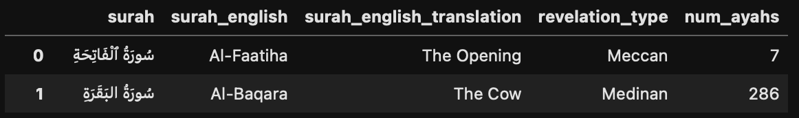

# Quran

## Overview
The Quran is the official religious text of Islam. The one and only book for Muslims which has been read and memorized by thousands across the globe in the Arabic language. 

*The goal for this repository is to have the Quran in a readeable data format to apply a data science question.*

In this repository, some words in this ```README.md``` and variable names in the respective ```.ipynb```/```.py``` files will be in *Arabic* though written in *English*. Here's a glossary of the variable names:

**Structure of the Quran**
- ```Surah```: Chapter (e.g. The Quran has a total of 114 chapters)
- ```Ayahs```: Verse
- ```Juz```: Part (i.e. The Quran is divided into 30 parts)


*Mock data. See ```data``` folder for updated dataset*

```bash
quran_dataset
├── data
│   ├── holy_quran.json 
├── README.md
├── quran_json_df.ipynb # in-progress
└── quran_json_download.py 
```

## Disclaimer
The data compiled here (```holy_quran.json```) is derived from [Al Quran Cloud API](https://alquran.cloud/api). 

The purpose and intent of this repository is aid in the *understanding* of the Quran. 

What do I mean by *understanding*? There are many data science tools/methods one can explore by using this data, NOT understanding the text itself, as the data compiled here has no related features. 

If there's an error (e.g., missing a word, تشكيل/Tashkil (i.e. Arabic vowelization), ayahs being out of order, etc.), one should consult the Quran. 

**The data presented does not and will never proceed the Quran.**

## Other Related Work
- [Unique Words for Each Surah](https://github.com/mmayet/quran_sandbox)
- [Similar Verses in the Quran](https://github.com/jawadshuaib/quran-similarity-search-jupyter-notebooks)
